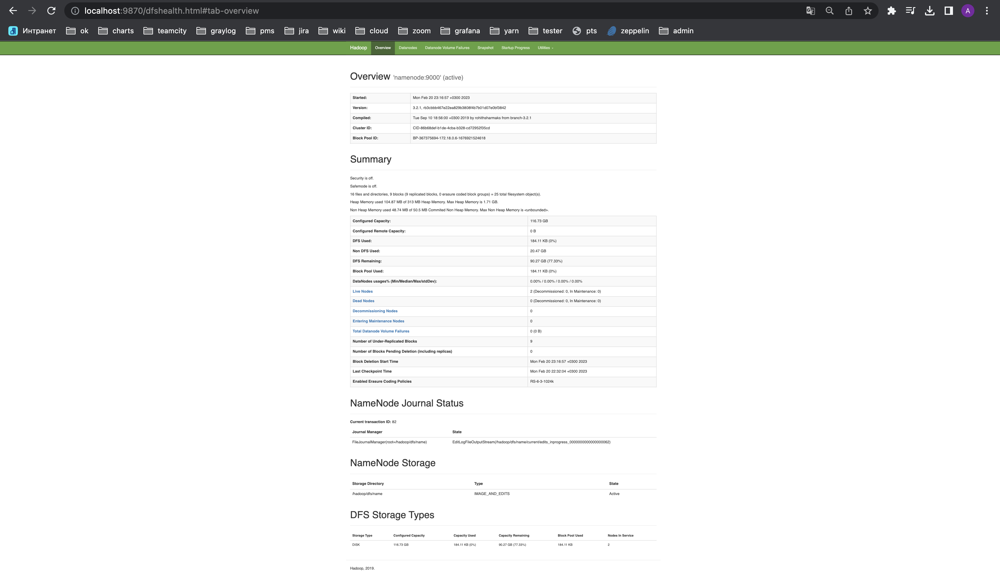
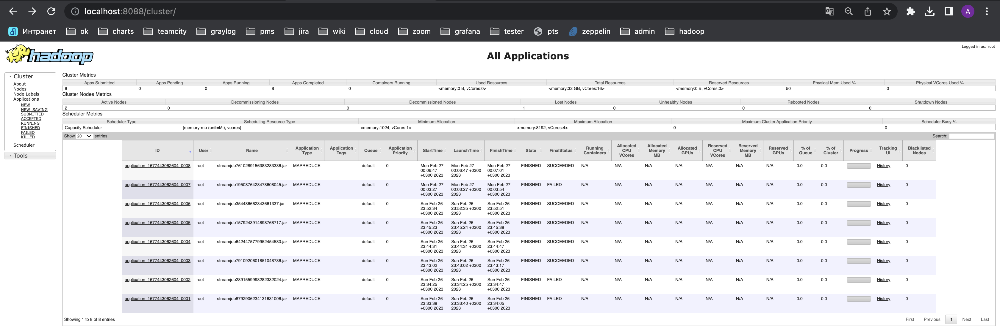
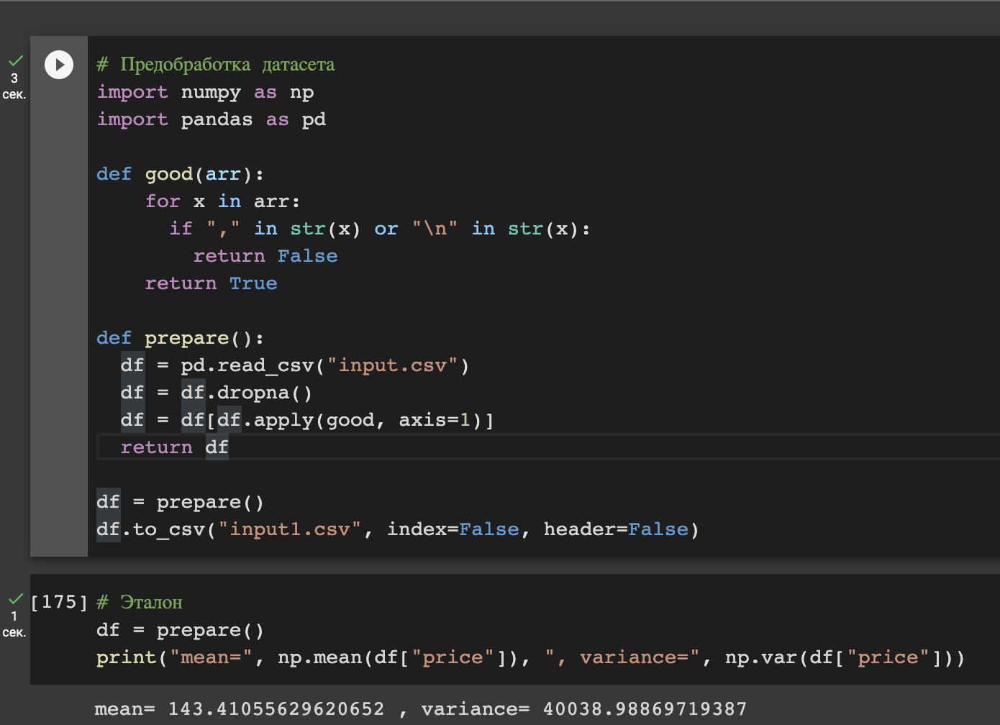
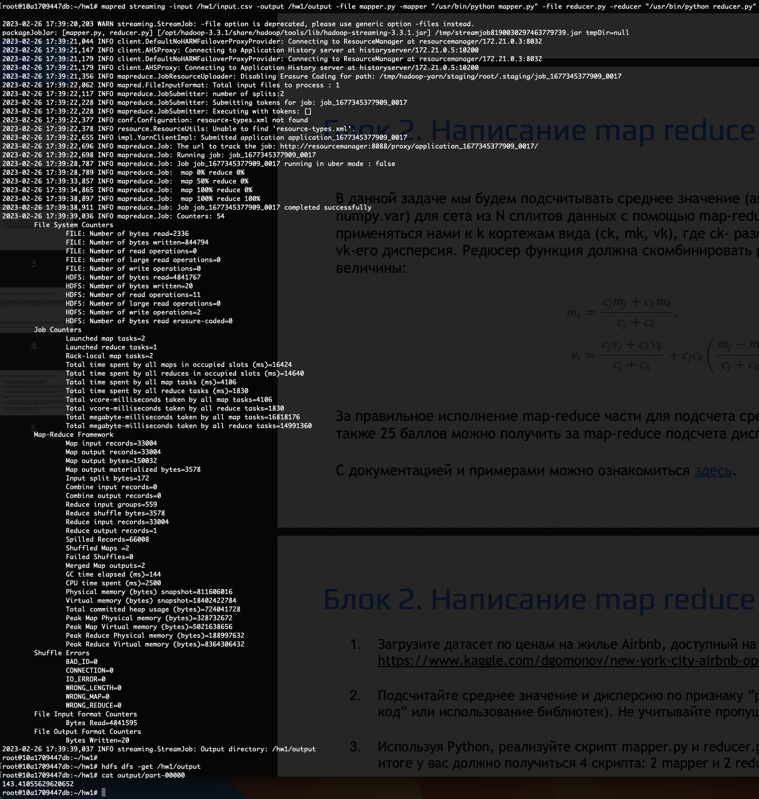
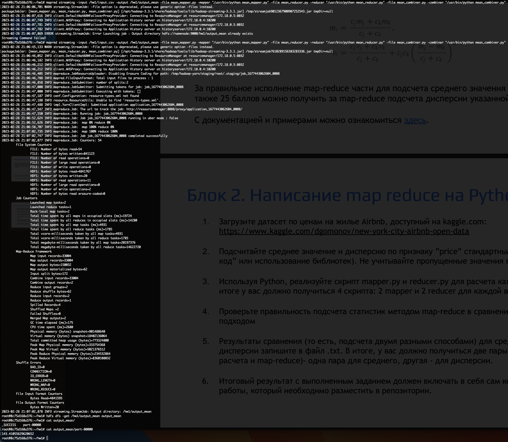
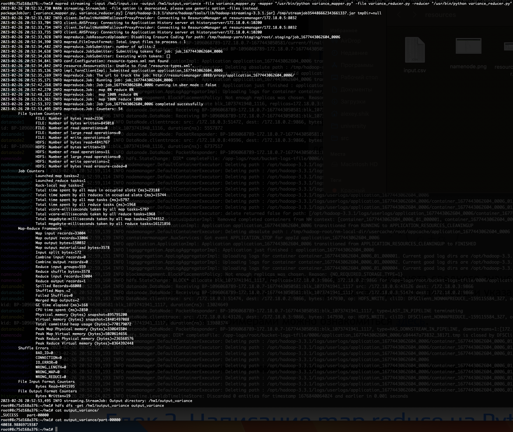
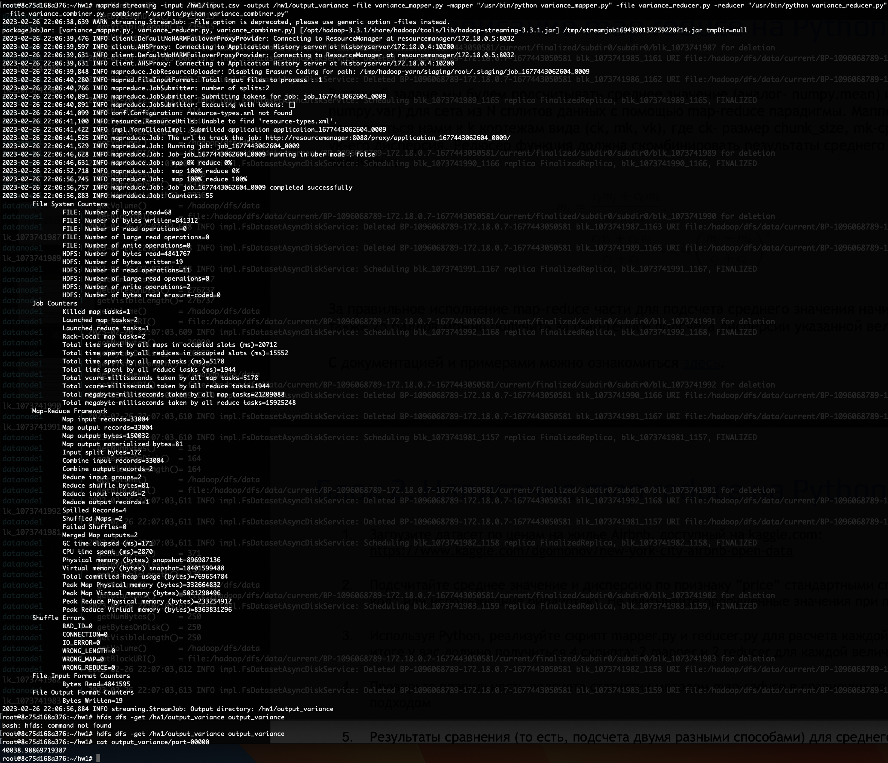

# Домашнее задание 1

## Локальный HDFS  
На скриншоте NN можно заметить, что подняты 2 DN.
  
На скриншоте RM видно, что было запущено 8 джоб, часть из них завершилась успешно, а часть с ошибкой.  

## Эталонные измерения  
Перед самими измерениями я выполнил предобработку датасета, чтобы:  
1) Избавиться от пропущенных данных  
2) Привести датасет к виду, в котором его получится обработать построчной mapreduce джобой. Для этого пришлось отфильтровать строки, содержащие в полях символы ',' и '\n', так как из-за запятой не получится правильно различать поля в csv файле, а из-за переноса строки одна логическая строка датасета превращается в две строки в csv файле, из-за чего в mapreduce джоба получит две половинки одной строки, а не целую. Конечно, эти пункты можно как-нибудь закостылять в самой джобе, но я принял решение упростить сами данные, потому что их много и не жалко потерять малую часть.   
  

## Mean Job
### Простое решение
Для начала я написал джобу из двух фаз:  
1) map-фаза преобразует строчку из датасета в число, соответствующее признаку "price".  
2) reduce-фаза подсчитывает сумму и количество полученных чисел, затем делит сумму на количество и получает среднее.  

Работает, результат верный:

### Улучшенное решение 
Так как в нашей задаче key для агрегации данных всего один, то будет разумно применить combiner, чтобы большую часть агрегации совершать до shuffle, тем самым значительно уменьшив объем данных для shuffle.  
Поэтому я сделал джобу из трех фаз:  
1) map-фаза преобразует строчку из датасета в число, соответствующее признаку "price".  
2) combiner-фаза подсчитывает сумму s_i и количество полученных чисел c_i, отправляет пару <s_i, c_i> дальше.  
3) reduce-фаза суммирует полученные s_i и c_i, затем делит итоговую сумму на итоговое количество и получает среднее.  

Работает, результат верный:  
  
Также, если внимательно посмотреть на скриншоты, то видно, что размер shuffle уменьшился с 3578 байт до 62 байт, то есть в 57,7 раз, звучит классно.  

## Variance Job
### Простое решение
Аналогично, сначала написал джобу из двух фаз:  
1) map-фаза преобразует строчку из датасета в число, соответствующее признаку "price".  
2) reduce-фаза подсчитывает сумму, сумму квадратов и количество полученных чисел, затем по известной формуле вычисляет дисперсию.    

Работает, результат верный:

### Улучшенное решение 
Так как в нашей задаче key для агрегации данных всего один, то будет разумно применить combiner, чтобы большую часть агрегации совершать до shuffle, тем самым значительно уменьшив объем данных для shuffle.    
Поэтому я сделал джобу из трех фаз:  
1) map-фаза преобразует строчку из датасета в число, соответствующее признаку "price".  
2) combiner-фаза подсчитывает сумму s_i, сумму квадратов s2_i и количество полученных чисел c_i, отправляет тройку <s_i, s2_i, c_i> дальше.  
3) reduce-фаза суммирует полученные s_i, s2_i и c_i, затем по известной формуле вычисляет дисперсию.    

Работает, результат верный:  
  
Также, если внимательно посмотреть на скриншоты, то видно, что размер shuffle уменьшился с 3578 байт до 81 байт, то есть в 44,2 раза, звучит классно. В этой джобе на shuffle уходит больше байт, потому что combiner передает в reducer тройки, а не пары.  

## Результат
1) Убедился, что hadoop streaming работает правильно и позволяет выполнять произвольный написанный в map-reduce парадигме код.
2) Научился разворачивать кластер hdfs и запускать на нем mapreduce джобы.
3) Научился оптимизировать объем данных для shuffle в простых случаях.  
